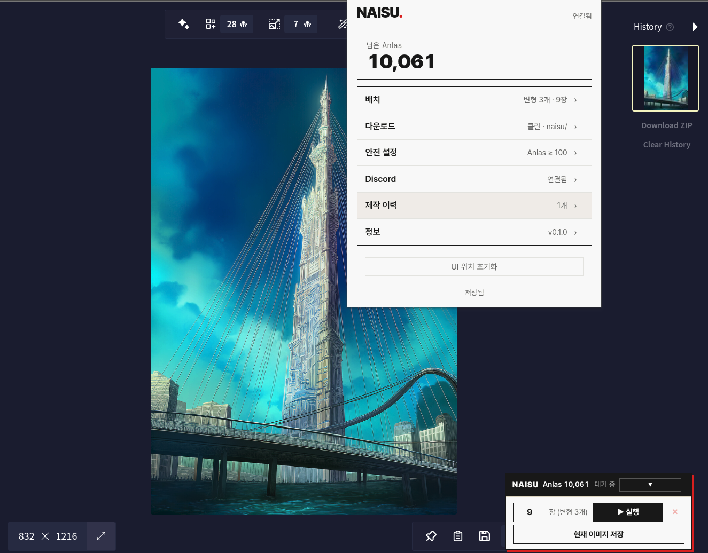
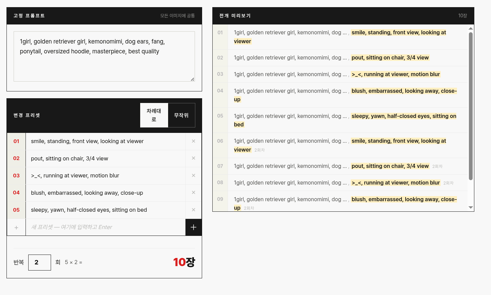

NovelAI 이미지 생성을 보조하는 크롬 확프

---



## 주요 기능

### 배치 자동 생성
프롬프트 변형 목록을 미리 설정해 두면, 버튼 한 번으로 N장을 자동으로 생성하고 저장합니다. 변형 모드를 끄면 같은 프롬프트로 원하는 장수만큼 반복 생성합니다.

- **고정 프롬프트 + 변형 프리셋** — 배경 프롬프트는 고정하고, 장마다 교체되는 부분만 목록으로 관리합니다.
- **순서대로 / 무작위** — 프리셋을 순서대로 순환하거나 매번 무작위로 선택합니다.
- **반복 횟수** — 변형 목록 전체를 몇 번 돌릴지 설정합니다. (변형 8개 × 반복 5 = 40장)



### 자동 다운로드
생성된 이미지를 자동으로 지정 폴더에 저장합니다.

- **클린 / 원본 / 둘 다** — 메타데이터(프롬프트·시드 등)를 제거한 클린 파일, 원본 파일, 또는 둘 다 저장합니다.
- **파일명 템플릿** — `{datetime}`, `{seed}`, `{model}`, `{w}`, `{h}`, `{steps}`, `{idx}` 등의 토큰으로 파일명을 자유롭게 구성합니다.
- **수동 저장** — 배치 실행 없이 현재 표시된 이미지를 즉시 저장합니다.

---

## 그 외 기능

- **안전 설정** — Anlas 최솟값, 생성 간격, 오류 재시도 횟수, 생성 제한 시간을 설정합니다. Anlas가 설정값 아래로 떨어지면 배치를 자동으로 멈춥니다.
- **Discord 웹훅** — 배치 시작·진행·완료·오류 알림을 Discord 채널로 전송합니다.
---

## 설치 및 사용

### 빌드

```bash
pnpm install
pnpm build        # dist/ 폴더 생성
```

개발 모드:

```bash
pnpm dev          # Vite + CRXJS, dist/ 자동 업데이트
pnpm test         # Vitest 유닛 테스트
pnpm typecheck    # tsc --noEmit
```

### Chrome에 로드

1. Chrome 주소창에 `chrome://extensions` 입력
2. 우측 상단 **개발자 모드** 활성화
3. **압축 해제된 확장 프로그램 로드** 클릭 → `dist/` 폴더 선택 (release에서 다운로드 받은 경우, 압축 해제 후 폴더 서낵)

### 사용 방법

1. `novelai.net/image`에 접속합니다.
2. 우측 하단에 **NAISU 패널**이 자동으로 표시됩니다.
3. Chrome 툴바의 NAISU 아이콘을 클릭해 팝업을 엽니다.
4. **배치** 메뉴에서 프롬프트와 변형 목록을 설정합니다.
5. 패널의 **▶ 실행** 버튼을 누르면 자동 생성이 시작됩니다.


### 주의 사항
1. 안전 설정의 생성 간격은 초기 1500ms (1.5초) 로 되어 있습니다. 이 설정을 낮추면 생성 속도가 빨라지지만, NovelAI 서버에 부하를 주어 차단될 수 있습니다. 