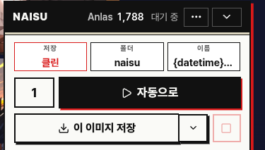
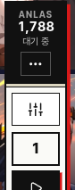

NovelAI 이미지 생성을 보조하는 크롬 확장

---


## 핵심 기능: 다운로드 시 메타데이터 안전 제거

NovelAI가 만든 이미지에는 프롬프트, 시드, 모델 같은 생성 정보가 파일 안에 그대로 남습니다(WebP EXIF 청크 + 알파 채널 은닉 둘 다). NAISU는 저장하는 순간 이걸 지웁니다.

---

## 그 외 기능

### 자동 다운로드 (상세 기능)
저장 방식은 네 가지 중 골라 씁니다: **하드클린**(픽셀을 다시 그려 WebP로 재인코딩, 가장 확실하지만 화질 살짝 저하), **클린**(EXIF, 알파 채널 은닉만 무손실 제거, WebP 유지), **원본**(그대로 저장), **둘 다**(클린 + 원본 `_raw`를 함께 저장). 이번 한 장만 다른 방식으로 저장할 수도 있습니다. 저장 후처리 화면에서 품질(100/90/80/70/60)과 출력 포맷을 고를 수 있습니다. 파일명은 `{datetime}`, `{seed}`, `{model}`, `{w}`, `{h}`, `{steps}`, `{idx}` 같은 토큰으로 구성하고, 배치 없이 화면의 이미지 한 장만 즉시 저장할 수도 있습니다.

<p>
  
  &nbsp;&nbsp;
  
</p>

우측 하단에 항상 떠 있는 패널에서 저장 방식, 폴더, 파일명을 바로 바꾸고 저장 결과를 확인합니다. 공간이 좁으면 아이콘 레일 모양으로 접어 둘 수 있습니다.

### 배치 자동 생성 (상세 기능)
프롬프트 변형 목록을 미리 설정해 두면 버튼 한 번으로 N장을 자동으로 생성, 저장합니다. 고정 프롬프트에 변형 프리셋을 순서대로 또는 무작위로 조합하고(변형 8개 × 반복 5 = 40장), 변형 모드를 끄면 같은 프롬프트로 원하는 장수만큼 반복 생성합니다.


### 안전 설정
Anlas 최솟값, 생성 간격, 오류 재시도 횟수, 생성 제한 시간을 설정합니다. Anlas가 설정값 아래로 떨어지면 배치를 자동으로 멈춥니다.

### Discord 웹훅
배치 시작, 진행, 완료, 오류 알림을 Discord 채널로 전송합니다.

---

## 설치 및 사용

### 빌드

```bash
pnpm install
pnpm build        # dist/ 폴더 생성
```

개발 모드:

```bash
pnpm dev          # Vite + CRXJS, dist/ 자동 업데이트
pnpm test         # Vitest 유닛 테스트
pnpm typecheck    # tsc --noEmit
```

### Chrome에 로드

1. Chrome 주소창에 `chrome://extensions` 입력
2. 우측 상단 **개발자 모드** 활성화
3. **압축 해제된 확장 프로그램 로드** 클릭 → `dist/` 폴더 선택 (release에서 다운로드 받은 경우, 압축 해제 후 폴더 선택)

### 사용 방법

1. `novelai.net/image`에 접속합니다.
2. 우측 하단에 **NAISU 패널**이 자동으로 표시됩니다.
3. Chrome 툴바의 NAISU 아이콘을 클릭해 팝업을 엽니다.
4. **배치** 메뉴에서 프롬프트와 변형 목록을 설정합니다.
5. 패널의 **▶ 실행** 버튼을 누르면 자동 생성이 시작됩니다.


### 주의 사항
1. 안전 설정의 생성 간격은 초기 2000ms (2초) 로 되어 있습니다. 이 설정을 낮추면 생성 속도가 빨라지지만, NovelAI 서버에 부하를 주어 차단될 수 있습니다.
